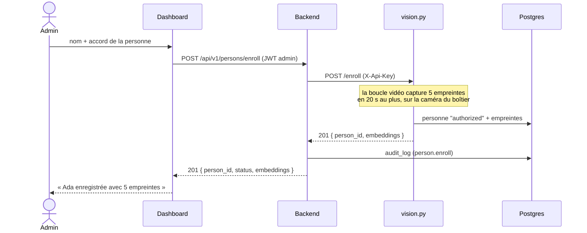

# Intégration du module vision — spécification pour l'équipe

| | |
|---|---|
| **Statut** | Proposé, rien n'est encore codé |
| **Date** | 2026-10-08 |
| **Branche** | `feat/vision`, après merge de `feat/model-reference-data` |
| **Plan d'implémentation** | [`docs/superpowers/plans/2026-10-07-integration-vision.md`](../plans/2026-10-07-integration-vision.md) |

## En bref

Le module `vision/` (reconnaissance faciale) fonctionne seul, mais il n'est pas branché sur le reste de Sentinel-X. Aujourd'hui ses alertes sont refusées par l'API, son flux vidéo n'apparaît pas dans le dashboard, et le bouton « Enregistrer une personne » du dashboard appelle une route qui n'existe pas.

Le back et le front sont déjà écrits selon le contrat de `docs/GUIDELINES.md`. **C'est donc `vision.py` qui s'aligne sur ce contrat**, avec trois retouches côté back, front et base.

Une fois le travail fait :

- un admin enregistre une personne autorisée depuis la page Personnes, la capture se fait avec la caméra du boîtier ;
- les personnes vues par la caméra remontent dans le dashboard : alertes, passages, flux vidéo annoté ;
- les personnes marquées « refusées » dans le dashboard sont reconnues et déclenchent une alerte critique.

## Ce qui ne marche pas aujourd'hui

Constaté sur `feat/vision`, en lisant le code et en rejouant les appels.

| Fonction | Ce que fait `vision.py` | Ce qu'attend le reste | Conséquence |
|---|---|---|---|
| Alertes | aucun en-tête d'authentification ; types `unknown_person`, `unidentified` | en-tête `X-Api-Key` ; types `PERSON_*` | l'API répond `401` |
| Enregistrement | script `add_person.py` en ligne de commande | `POST /enroll` sur `vision.py`, appelé par le back | le bouton du dashboard répond « Service vision non configuré » |
| Flux vidéo | `/video` sur le port 5001 | `/video/stream` | « Flux vidéo indisponible » dans la vue d'ensemble |
| Passages | lignes « non identifié » sans personne ni score | `person_id` et `similarity` obligatoires dans `face_sightings` | erreurs d'insertion |
| Compte Postgres | rôle `vision_service`, créé par `vision/sentinel_vision.sql` | rôle `sentinel_vision`, créé par les migrations | un rôle en double dès que le script est lancé, avec un mot de passe écrit dans Git |
| Personnes refusées | statut `denied` ignoré | alerte `PERSON_DENIED` (GUIDELINES §8) | une personne refusée n'est jamais signalée |

`add_person.py` écrit directement dans Postgres avec le compte propriétaire de la base. Il fonctionne, mais il contourne le back : ni contrôle du rôle admin, ni trace dans `audit_log`.

## Ce qui change, brique par brique

### Module vision (`vision/`)

C'est la brique la plus touchée. Les réglages de détection et de reconnaissance (seuils, suivi, modèles) ne changent pas.

**Comportement modifié**

| Sujet | Avant | Après |
|---|---|---|
| Types d'alerte | `unknown_person`, `unidentified` | `PERSON_UNKNOWN`, `PERSON_RETURNING`, `PERSON_DENIED`, `PERSON_DETECTED` |
| Authentification | aucune | clé du service vision dans `X-Api-Key` |
| Animaux et objets en mouvement | alerte `unidentified` | encadrés sur la vidéo, **aucune alerte** |
| Personnes refusées | ignorées | reconnues en priorité, cadre rouge « PERSONNE REFUSEE » |
| Fréquence des alertes | une par suivi | une par passage (voir ci-dessous) |
| Compteur de passages | + 1 à chaque suivi | + 1 si la personne n'a pas été vue depuis 30 minutes |
| Passages « non identifié » | écrits en base | plus écrits (le schéma exige une personne) |
| Routes HTTP | `GET /video` | `GET /video`, `GET /video/stream`, `POST /enroll` |
| Port | 5001, fixe | `VISION_PORT` dans `.env`, 5001 par défaut |
| Compte Postgres | `vision_service` | `sentinel_vision` |

**Correspondance des alertes** (GUIDELINES §8)

| Cas | Type | Sévérité |
|---|---|---|
| Inconnu, premier passage | `PERSON_UNKNOWN` | warning |
| Inconnu déjà mémorisé, revu après 30 minutes | `PERSON_RETURNING` | critical |
| Personne refusée reconnue | `PERSON_DENIED` | critical |
| Personne dont le visage n'est pas exploitable | `PERSON_DETECTED` | warning |
| Personne autorisée | aucune alerte | |

**Un passage, une alerte.** Le suivi perd parfois une personne quelques secondes puis la retrouve. Pour ne pas renvoyer une alerte à chaque fois, une alerte n'est envoyée qu'au début d'un passage, c'est-à-dire quand la personne n'a pas été vue depuis 30 minutes. C'est la définition du « nouveau passage » de GUIDELINES §8.

**Fichiers**

| Fichier | Action | Rôle |
|---|---|---|
| `vision.py` | modifié | branchement, routes HTTP, configuration |
| `faces.py` | modifié | prise en compte du statut `denied` |
| `alerts.py` | nouveau | types d'alerte, envoi à l'API, règle des 30 minutes |
| `enroll.py` | nouveau | capture des empreintes pour l'enregistrement |
| `tests/` | nouveau | tests pytest, sans caméra ni base |
| `sentinel_vision.sql` | supprimé | doublon des migrations du back |
| `add_person.py` | inchangé | enregistrement de secours par photos, pour un PC sans webcam |

### Backend (`backend/`)

- **Relais d'enregistrement** : `POST /api/v1/persons/enroll` existe déjà et relaie à `vision.py`. Il enverra en plus la clé du service vision, et renverra le nombre d'empreintes capturées.
- **Réponse** : `{ person_id, status: "authorized", embeddings }`. Le champ `embeddings` est un nombre, jamais les empreintes elles-mêmes.
- **Refus si mal configuré** : `503 SERVICE_UNAVAILABLE` si `VISION_URL` ou la clé `vision` de `SERVICE_API_KEYS` manque.
- **Rien d'autre ne change** : routes, rôles, règles d'intrusion et format des alertes restent ceux de GUIDELINES.

### Base de données

Une migration, **`0006_vision_sightings.sql`** (la `0005` est celle de `feat/model-reference-data`). Elle n'ajoute ni table ni colonne, seulement deux droits au rôle `sentinel_vision` sur `face_sightings` :

- lire l'identifiant d'un passage qu'il vient de créer ;
- mettre à jour ce passage (statut, score, alerte rattachée).

Sans ces droits, `vision.py` peut créer un passage mais ne peut ni le compléter ni le relier à son alerte.

### Dashboard (`frontend/`)

- **Formulaire d'enregistrement** (page Personnes, rôle admin) : pendant la capture, le formulaire affiche le flux de la caméra et une consigne. À la fin, il affiche le résultat réel : nom et nombre d'empreintes, ou le motif du refus.
- **Liste des personnes** : elle se recharge à chaque alerte vision. Un nouvel inconnu apparaît sans rafraîchir la page.
- **Flux vidéo en dev** : le proxy Vite pointe `/video` vers `vision.py` (port 5001).

## Parcours : enregistrer une personne



Règles de la capture :

- la personne doit être **seule** et **de face** devant la caméra du boîtier ;
- la capture vise 5 empreintes, espacées de 0,7 seconde pour varier légèrement l'angle ;
- elle s'arrête à 5 empreintes ou au bout de 20 secondes ; en dessous de 3 empreintes, l'enregistrement est refusé ;
- pendant la capture, `vision.py` n'identifie personne, pour ne pas classer comme inconnue la personne en cours d'enregistrement ;
- aucune image n'est gardée, seulement les empreintes.

## Contrat de `POST /enroll` (vision.py)

Route interne, appelée seulement par le backend.

**Requête**

```http
POST /enroll
X-Api-Key: <clé du service vision>
Content-Type: application/json

{ "display_name": "Ada Lovelace", "consent_at": "2026-10-08T09:12:00.000Z", "created_by": "<uuid de l'admin>", "device_id": null }
```

**Réponses**

| Code | Cas | Message affiché dans le dashboard |
|---|---|---|
| `201` | personne créée | `{ "person_id": "...", "embeddings": 5 }` |
| `401` | clé absente ou fausse | Clé de service invalide |
| `409` | une capture est déjà en cours | Un enregistrement est déjà en cours |
| `409` | ce visage est déjà enregistré | Cette personne est déjà enregistrée : *nom* |
| `422` | nom ou accord manquant | *champ concerné* |
| `422` | pas assez d'empreintes en 20 secondes | Aucun visage exploitable : une seule personne, de face, devant la caméra du boîtier |
| `500` | écriture en base impossible | Enregistrement impossible en base |
| `503` | `API_KEY` absente du `.env` de vision | *configuration à corriger* |

Les erreurs ont la forme `{ "message": "..." }`. Le backend relaie ce message au dashboard.

**Pourquoi refuser un visage déjà enregistré.** Si le même visage a deux fiches, `vision.py` ne sait plus à laquelle l'attribuer et refuse de trancher : la personne ne serait plus jamais reconnue.

## Sécurité et RGPD

- **`/enroll` est protégée.** Sans clé, n'importe qui sur le réseau du boîtier pourrait s'ajouter comme personne autorisée. La clé est celle du service `vision`, déjà prévue dans `SERVICE_API_KEYS`.
- **L'enregistrement passe par le back.** Le rôle admin est vérifié, l'accord de la personne est obligatoire et daté (`consent_at`), l'action est tracée dans `audit_log`.
- **Moindre privilège.** `vision.py` se connecte avec `sentinel_vision`, plus avec le compte propriétaire de la base.
- **Aucun secret dans Git.** `vision/sentinel_vision.sql` contenait un mot de passe en clair ; il est supprimé. Les mots de passe viennent des `.env`, posés par `npm run db:roles`.
- **Données biométriques.** Aucune image de visage n'est stockée ni envoyée, hors flux vidéo annoté. Les empreintes ne sortent jamais par une route HTTP. Les inconnus restent effacés au bout de 72 heures.

## Ce que chacun doit faire après le merge

Trois valeurs relient les deux fichiers `.env`. Elles sont propres à chaque machine et ne vont jamais dans Git.

| `backend/.env` | `vision/.env` |
|---|---|
| `SERVICE_API_KEYS=vision=<clé>` | `API_KEY=<clé>` |
| `DB_VISION_PASSWORD=<mot de passe>` | `DB_USER=sentinel_vision`, `DB_PASSWORD=<mot de passe>` |
| `VISION_URL=http://localhost:5001` | `VISION_PORT=5001` |

Puis, sur chaque poste :

1. `npm --prefix backend run db:migrate` applique la migration `0006`.
2. `npm --prefix backend run db:roles` active la connexion du rôle `sentinel_vision`.
3. Redémarrer le back : il ne relit pas son `.env` à chaud.
4. Pour lancer les tests du module vision : `pip install -r requirements-dev.txt` dans son environnement Python.

Le plan d'implémentation donne les commandes exactes, y compris la génération des secrets de dev.

## Décisions prises

| Décision | Raison | Alternative écartée |
|---|---|---|
| Capture par la caméra du boîtier | c'est ce que prévoient déjà le back, le front et GUIDELINES ; aucune image sur le réseau ; même caméra pour enregistrer et pour reconnaître | webcam du navigateur : enregistrement depuis son bureau, mais images de visage envoyées au back et précision moindre |
| `vision.py` s'aligne sur le contrat | le back et le front le respectent déjà | modifier le contrat et les deux autres briques |
| Plus d'alerte pour les animaux et les objets | le contrat n'a que des types `PERSON_*`, et ceux-ci déclenchent la règle d'intrusion confirmée : un chat pourrait faire sonner le buzzer | ajouter un type d'alerte au contrat |
| Une alerte par passage de 30 minutes | évite une alerte à chaque perte de suivi ; reprend la définition de GUIDELINES §8 | une alerte par suivi, comme aujourd'hui |
| `add_person.py` conservé | seul moyen d'enregistrer depuis un PC sans webcam | le supprimer |

## Limites connues

- **Changement de statut en cours de passage.** Une personne passée en « refusée » alors qu'elle est devant la caméra ne déclenche l'alerte qu'à son prochain passage, 30 minutes plus tard au moins.
- **Fiche « Inconnu » résiduelle.** Si la personne a été vue comme inconnue avant d'être enregistrée, sa fiche « Inconnu » reste dans le dashboard jusqu'à l'effacement automatique à 72 heures. Elle ne gêne pas la reconnaissance : les personnes enregistrées sont prioritaires.
- **Versions Python non figées.** `requirements.txt` ne fixe aucune version ; une installation du 2026-10-07 a pris OpenCV 5.0.0.
- **Production.** Le `docker-compose.yml` de production et nginx ne sont pas couverts ; `/video/stream` doit y rester réservé au rôle viewer.

## Points à trancher en équipe

1. **Animaux et objets sans alerte** : l'auteur du module vision est-il d'accord, ou faut-il un type d'alerte dédié dans le contrat ?
2. **`docs/GUIDELINES.md` §8** : le tableau des alertes ne décrit ni `PERSON_DETECTED` ni le cas des animaux et objets. Qui le met à jour ?
3. **Versions Python** : fige-t-on les versions dans `requirements.txt`, et sur quelle version d'OpenCV le module a-t-il été développé ?

## Comment ce sera vérifié

- **Tests automatiques** : pytest pour le module vision (alertes, capture, routes HTTP, personnes refusées) et vitest pour le relais du backend. Ils tournent sans caméra ni base.
- **Recette sur le PC avec webcam** : inconnu détecté, enregistrement depuis le dashboard, reconnaissance au retour, personne refusée, personne de dos, objet en mouvement sans alerte. Le tableau complet est dans la tâche 9 du plan.
